# Clean Architecture
{: .no_toc }

Clean Architecture desde Cero, una explicacion mas sencilla a como se enseña tecnicamente para entender mejor los conceptos.
{: .fs-6 .fw-100 }

Finalmente esto se aplicara en un desarrollo en .net8

{: .no_toc .text-delta }

1. TOC
{:toc}

---

# Explicacion teorica simple

PARTE 1: ¿Qué problema queremos resolver?

Antes de hablar de arquitectura, pensemos en el problema que resuelven estas ideas.

Imagina que estás construyendo una aplicación (por ejemplo, una app para gestionar pedidos en un restaurante 🍔).
Con el tiempo, el código se vuelve difícil de entender:

* Hay lógica de negocio mezclada con código de base de datos.
* Los cambios en una parte rompen otras.
* No sabes dónde poner cada cosa nueva.

👉 DDD y Clean Architecture buscan organizar el código para:

* Mantener la lógica de negocio limpia y aislada.
* Permitir cambiar la base de datos o frameworks sin reescribir todo.
* Tener un código modular, fácil de probar y mantener.

## Qué es DDD (Domain-Driven Design)

DDD = Diseño guiado por el dominio.

“Dominio” = el problema principal que tu software resuelve.

Ejemplo:

En una app de pedidos, el dominio es cómo se crean, pagan, y entregan los pedidos.
No es la base de datos, ni la API, ni la interfaz.
Es el corazón del negocio.

## Objetivo de DDD:

Centrar el diseño del software en el lenguaje y reglas del negocio, no en los detalles técnicos.

### Conceptos básicos de DDD

| Concepto                              | Qué es                                                      | Ejemplo                                  |
| ------------------------------------- | ----------------------------------------------------------- | ---------------------------------------- |
| **Entidad (Entity)**                  | Un objeto con identidad propia                              | Un `Pedido` o un `Cliente`               |
| **Valor (Value Object)**              | Un dato sin identidad, definido por su valor                | Un `Email`, una `Dirección`, un `Precio` |
| **Agregado (Aggregate)**              | Conjunto de entidades que se gestionan como una sola unidad | Un `Pedido` con sus `Items`              |
| **Repositorio (Repository)**          | Abstracción para guardar/leer objetos del dominio           | `PedidoRepository` guarda pedidos en BD  |
| **Servicio de dominio**               | Lógica de negocio que no encaja en una sola entidad         | “Calcular total del pedido”              |
| **Caso de uso / Application Service** | Ejecuta una acción del sistema                              | “Crear pedido”, “Pagar pedido”           |

## Qué es Clean Architecture

Clean Architecture (Arquitectura Limpia) fue propuesta por Robert C. Martin (“Uncle Bob”).
Su objetivo es separar responsabilidades por capas.

Imagina círculos concéntricos:

```
┌──────────────────────────┐
│        Infraestructura   │  (frameworks, DB, API, etc.)
├──────────────────────────┤
│     Casos de Uso         │  (aplicación)
├──────────────────────────┤
│     Dominio              │  (reglas de negocio puras)
└──────────────────────────┘
```

**Reglas principales:**

1. Las dependencias siempre van hacia adentro.
   - El dominio no debe depender de frameworks ni bases de datos.
1. La lógica del negocio no debería saber si usas SQL, Mongo o Firebase.
1. Puedes cambiar la tecnología sin tocar las reglas del negocio.

--- 

### Que son los casos de uso

Un caso de uso representa una acción completa del sistema desde el punto de vista del negocio.

👉 Es una unidad de lógica de aplicación, no de dominio ni de infraestructura.

Por ejemplo, si tu aplicación permite gestionar pedidos, podrías tener casos de uso como:

* CrearPedido
* AgregarProductoAPedido
* PagarPedido
* CancelarPedido
* ListarPedidosDeCliente

**📜 Diferencia entre capa de dominio y casos de uso**

| Capa                          | Qué contiene                    | Ejemplo                                 | Se preocupa por                          |
| ----------------------------- | ------------------------------- | --------------------------------------- | ---------------------------------------- |
| **Dominio**                   | Entidades, valores, lógica pura | `Pedido`, `Producto`, `CalcularTotal()` | Reglas del negocio                       |
| **Aplicación (Casos de uso)** | Orquesta el dominio             | `CrearPedidoHandler`                    | Qué hacer con esas reglas y en qué orden |
| **Infraestructura**           | Implementa detalles técnicos    | BD, API, mensajería, archivos           | Cómo se hace técnicamente                |

---

** 🧱  ¿Qué hace un Caso de Uso?**

1. Recibe una solicitud (request) con datos de entrada (por ejemplo, “crear pedido para el cliente 123”).
1. Usa el dominio para ejecutar las reglas de negocio (por ejemplo, crea un Pedido, calcula el total).
1. Guarda o consulta datos a través de interfaces (repositorios).
1. Devuelve un resultado (response) al mundo exterior.

---

# Ejemplo conceptual: CrearPedido

Paso a paso:

1. El usuario manda una solicitud a la API (POST /pedidos).
1. El controlador llama al caso de uso CrearPedidoHandler.
1. El caso de uso:
   - Valida los datos.
   - Crea una entidad Pedido.
   - Usa IPedidoRepository (una interfaz del dominio) para guardarlo.
   - Devuelve el pedido creado.
1. La capa de infraestructura implementa PedidoRepository con EF Core o lo que uses.

>💡 El caso de uso no sabe si los datos van a SQL, Mongo, o memoria:
> solo usa interfaces (abstracciones).

## Estructura de un proyecto DDD + Clean Architecture en .NET 8

Supongamos una solución llamada PedidosApp. La estructura de carpetas y proyectos

```
PedidosApp.sln
│
├── PedidosApp.Domain           # Reglas de negocio puras
│   ├── Entities/
│   ├── ValueObjects/
│   ├── Interfaces/
│   └── DomainExceptions/
│
├── PedidosApp.Application      # Casos de uso (application layer)
│   ├── UseCases/
│   ├── DTOs/
│   ├── Interfaces/             # Repositorios y servicios
│   └── Services/
│
├── PedidosApp.Infrastructure   # Implementaciones técnicas
│   ├── Persistence/            # EF Core, archivos, etc.
│   ├── Repositories/
│   └── Configurations/
│
└── PedidosApp.Api              # Capa de presentación (Controllers)
    ├── Controllers/
    ├── DTOs/
    └── Program.cs
```

### Dependencias (muy importante)

* **`PedidosApp.Api`** → depende de **`PedidosApp.Application`**
* **`PedidosApp.Application`** → depende de **`PedidosApp.Domain`**
* **`PedidosApp.Infrastructure`** → depende de Domain y Application
* Nunca al revés

Así logramos que el Dominio quede totalmente limpio.

## Flujo Completo

1. Controller recibe una petición HTTP.
1. Llama al Caso de Uso (CrearPedidoHandler).
1. El caso de uso utiliza:
   - Entidades del Dominio
   - Interfaces de Repositorios
1. El caso de uso pide guardar los datos.
1. Infraestructura implementa esas interfaces usando EF Core.
1. Devuelve respuesta al Controller.

```mermaid
flowchart TD
    %% ======== CAPAS ======== %%
    subgraph API["🟣 Capa de Presentación (API / UI)"]
        Controller["PedidosController"]
    end

    subgraph Application["🟡 Capa de Aplicación (Casos de Uso)"]
        UseCase["CrearPedidoHandler (Caso de Uso)"]
        DTO["CrearPedidoRequest / Response"]
    end

    subgraph Domain["🟢 Capa de Dominio"]
        Entity["Pedido (Entity)"]
        ValueObject["ItemPedido (Value Object)"]
        RepoInterface["IPedidoRepository (Interface)"]
    end

    subgraph Infrastructure["🔵 Capa de Infraestructura"]
        RepoImpl["PedidoRepository (Implementación)"]
        DbContext["AppDbContext (EF Core)"]
        Database["🗄️ Base de Datos"]
    end

    %% ======== FLUJO DE EJECUCIÓN ======== %%
    Controller -->|Recibe solicitud HTTP| UseCase
    UseCase -->|Usa entidades del dominio| Entity
    UseCase -->|Depende de interfaz| RepoInterface
    RepoInterface -->|Implementación concreta| RepoImpl
    RepoImpl -->|Usa EF Core| DbContext
    DbContext -->|Guarda/lee datos| Database

    %% ======== DEPENDENCIAS INVERSAS ======== %%
    RepoImpl -.-> RepoInterface
    UseCase -.-> Domain
    Controller -.-> Application

    %% ======== ESTILO ======== %%
    classDef layer fill:#f9f9f9,stroke:#888,stroke-width:1px,corner-radius:6px;
    classDef domain fill:#eaffea,stroke:#6c6,stroke-width:1px;
    classDef app fill:#fff9e6,stroke:#cc6,stroke-width:1px;
    classDef infra fill:#e6f0ff,stroke:#66c,stroke-width:1px;
    classDef api fill:#f3e6ff,stroke:#96c,stroke-width:1px;

    class Domain domain;
    class Application app;
    class Infrastructure infra;
    class API api;
```



El segundo diagrama Mermaid mostrando las dependencias entre los proyectos .NET (assemblies) dentro de una solución basada en DDD + Clean Architecture.

```
+----------------------------------------------------+
|                    🟣 API Layer                    |
|  (Controllers / Endpoints / Program.cs)            |
|                                                    |
|  -> Llama a los Casos de Uso                       |
+----------------------------|-----------------------+
                             |
                             v
+----------------------------------------------------+
|               🟡 Application Layer                 |
|  (UseCases / DTOs / Interfaces)                    |
|                                                    |
|  -> Orquesta la lógica de negocio                  |
|  -> Usa Entidades y Repositorios (interfaces)      |
+----------------------------|-----------------------+
                             |
                             v
+----------------------------------------------------+
|                   🟢 Domain Layer                  |
|  (Entities / ValueObjects / Rules / Interfaces)    |
|                                                    |
|  -> Contiene la lógica del negocio puro            |
|  -> No depende de otras capas                      |
+----------------------------|-----------------------+
                             |
                             v
+----------------------------------------------------+
|             🔵 Infrastructure Layer                |
|  (EF Core / Repositories / External Services)      |
|                                                    |
|  -> Implementa las interfaces del dominio          |
|  -> Conecta con la base de datos u otros sistemas  |
+----------------------------------------------------+

```

El usuario → API → Caso de Uso → Dominio → Repositorio (Infraestructura) → Base de datos
Las dependencias van siempre hacia abajo, pero la infraestructura implementa interfaces definidas arriba, no al revés.


## Estructura Recomendada

```
PedidosApp/                                 ← 📁 Repositorio raíz (Git)
│
├── src/                                    ← Código fuente principal
│   ├── PedidosApp.sln                      ← Archivo de solución
│   │
│   ├── PedidosApp.Domain/                  ← 🟢 Proyecto de dominio
│   │   └── PedidosApp.Domain.csproj
│   │
│   ├── PedidosApp.Application/             ← 🟡 Proyecto de aplicación
│   │   └── PedidosApp.Application.csproj
│   │
│   ├── PedidosApp.Infrastructure/          ← 🔵 Proyecto de infraestructura
│   │   └── PedidosApp.Infrastructure.csproj
│   │
│   └── PedidosApp.Api/                     ← 🟣 Proyecto de presentación (Web API)
│       └── PedidosApp.Api.csproj
│
└── tests/                                  ← 📁 Pruebas unitarias
    ├── PedidosApp.UnitTests/               ← Proyecto de tests
    │   └── PedidosApp.UnitTests.csproj
    └── PedidosApp.IntegrationTests/ (opcional)
        └── PedidosApp.IntegrationTests.csproj

```

# Construccion

El error más común: empezar por la base de datos.

**"Voy a crear las tablas en SQL primero, luego hago los modelos y ya está."**
**"Necesito 8 tablas"**

Eso no es DDD, eso es data-driven design.

DDD hace lo contrario, empieza desde el negocio (el dominio), no desde la base de datos.

**“Tengo 8 conceptos o cosas del dominio que interactúan entre sí.”**

## Cómo se parte en DDD (flujo conceptual)

| Etapa                                                 | Qué defines                                         | Capa involucrada |
| ----------------------------------------------------- | --------------------------------------------------- | ---------------- |
| 🧠 **1. Descubrir el dominio**                        | Qué entidades y reglas de negocio existen           | Dominio          |
| 🧱 **2. Modelar entidades y relaciones**              | Entidades, value objects, agregados                 | Dominio          |
| 🧩 **3. Definir casos de uso (acciones del sistema)** | Qué operaciones puede hacer el usuario o el sistema | Application      |
| ⚙️ **4. Crear interfaces técnicas**                   | Repositorios, servicios externos, puertos           | Dominio          |
| 💾 **5. Implementar la infraestructura real**         | EF Core, persistencia, APIs externas, logs          | Infrastructure   |
| 🧾 **6. Exponerlo**                                   | Endpoints en la API (controllers)                   | API              |

### 1. Descubrir el dominio

Es el proceso de:

1. Entender qué problema resuelve el sistema.
1. Identificar los conceptos principales (entidades, eventos, acciones).
1. Nombrarlos con palabras del negocio, no técnicas.

**Ejemplo práctico: Sistema de Pedidos**

Supongamos que la empresa dice:

>“Nuestros clientes hacen pedidos de productos.
 Cada pedido tiene varios ítems, y dependiendo de la categoría del cliente,
 los impuestos cambian. Después, se genera una factura y se registra un pago.”

Mapa visual del dominio:

```
Cliente
  └── hace muchos Pedidos
          ├── tiene muchos ItemPedido
          │       └── pertenecen a Productos
          ├── genera una Factura
          └── se paga con un Pago
```

### 2. Modelar entidades y relaciones

