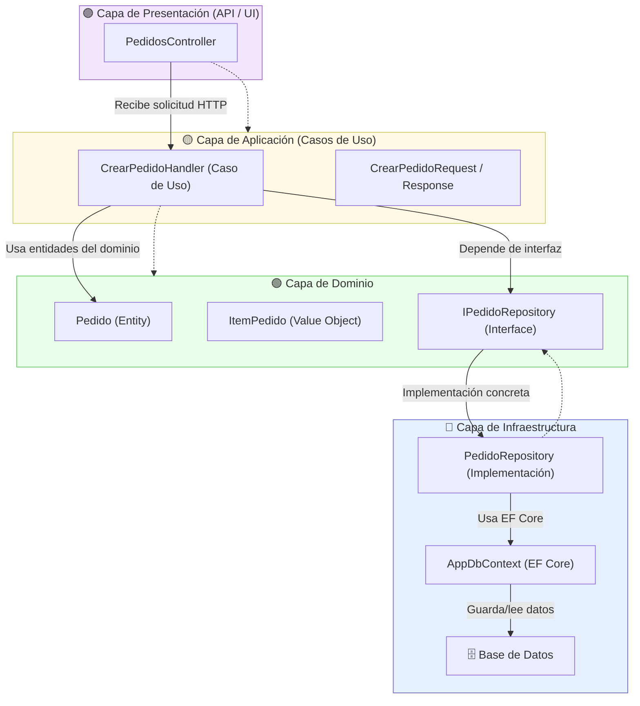
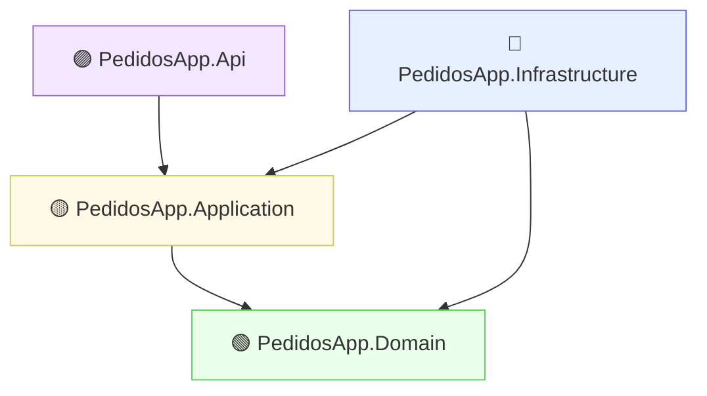

# Clean Architecture
{: .no_toc }

Clean Architecture desde Cero, una explicacion mas sencilla a como se enseña tecnicamente para entender mejor los conceptos.
{: .fs-6 .fw-100 }

Finalmente esto se aplicara en un desarrollo en .net8

{: .no_toc .text-delta }

1. TOC
{:toc}

---

# Explicacion teorica simple

PARTE 1: ¿Qué problema queremos resolver?

Antes de hablar de arquitectura, pensemos en el problema que resuelven estas ideas.

Imagina que estás construyendo una aplicación (por ejemplo, una app para gestionar pedidos en un restaurante 🍔).
Con el tiempo, el código se vuelve difícil de entender:

* Hay lógica de negocio mezclada con código de base de datos.
* Los cambios en una parte rompen otras.
* No sabes dónde poner cada cosa nueva.

👉 DDD y Clean Architecture buscan organizar el código para:

* Mantener la lógica de negocio limpia y aislada.
* Permitir cambiar la base de datos o frameworks sin reescribir todo.
* Tener un código modular, fácil de probar y mantener.

## Qué es DDD (Domain-Driven Design)

DDD = Diseño guiado por el dominio.

“Dominio” = el problema principal que tu software resuelve.

Ejemplo:

En una app de pedidos, el dominio es cómo se crean, pagan, y entregan los pedidos.
No es la base de datos, ni la API, ni la interfaz.
Es el corazón del negocio.

📚 Objetivo de DDD:

Centrar el diseño del software en el lenguaje y reglas del negocio, no en los detalles técnicos.

### Conceptos básicos de DDD

| Concepto                              | Qué es                                                      | Ejemplo                                  |
| ------------------------------------- | ----------------------------------------------------------- | ---------------------------------------- |
| **Entidad (Entity)**                  | Un objeto con identidad propia                              | Un `Pedido` o un `Cliente`               |
| **Valor (Value Object)**              | Un dato sin identidad, definido por su valor                | Un `Email`, una `Dirección`, un `Precio` |
| **Agregado (Aggregate)**              | Conjunto de entidades que se gestionan como una sola unidad | Un `Pedido` con sus `Items`              |
| **Repositorio (Repository)**          | Abstracción para guardar/leer objetos del dominio           | `PedidoRepository` guarda pedidos en BD  |
| **Servicio de dominio**               | Lógica de negocio que no encaja en una sola entidad         | “Calcular total del pedido”              |
| **Caso de uso / Application Service** | Ejecuta una acción del sistema                              | “Crear pedido”, “Pagar pedido”           |

## Qué es Clean Architecture

Clean Architecture (Arquitectura Limpia) fue propuesta por Robert C. Martin (“Uncle Bob”).
Su objetivo es separar responsabilidades por capas.

Imagina círculos concéntricos:

```
┌──────────────────────────┐
│        Infraestructura   │  (frameworks, DB, API, etc.)
├──────────────────────────┤
│     Casos de Uso         │  (aplicación)
├──────────────────────────┤
│     Dominio              │  (reglas de negocio puras)
└──────────────────────────┘
```

**Reglas principales:**

1. Las dependencias siempre van hacia adentro.
   - El dominio no debe depender de frameworks ni bases de datos.
1. La lógica del negocio no debería saber si usas SQL, Mongo o Firebase.
1. Puedes cambiar la tecnología sin tocar las reglas del negocio.

--- 

### Que son los casos de uso

Un caso de uso representa una acción completa del sistema desde el punto de vista del negocio.

👉 Es una unidad de lógica de aplicación, no de dominio ni de infraestructura.

Por ejemplo, si tu aplicación permite gestionar pedidos, podrías tener casos de uso como:

* CrearPedido
* AgregarProductoAPedido
* PagarPedido
* CancelarPedido
* ListarPedidosDeCliente

📜 ** Diferencia entre capa de dominio y casos de uso**

| Capa                          | Qué contiene                    | Ejemplo                                 | Se preocupa por                          |
| ----------------------------- | ------------------------------- | --------------------------------------- | ---------------------------------------- |
| **Dominio**                   | Entidades, valores, lógica pura | `Pedido`, `Producto`, `CalcularTotal()` | Reglas del negocio                       |
| **Aplicación (Casos de uso)** | Orquesta el dominio             | `CrearPedidoHandler`                    | Qué hacer con esas reglas y en qué orden |
| **Infraestructura**           | Implementa detalles técnicos    | BD, API, mensajería, archivos           | Cómo se hace técnicamente                |

---

🧱 ** ¿Qué hace un Caso de Uso?**

1. Recibe una solicitud (request) con datos de entrada (por ejemplo, “crear pedido para el cliente 123”).
1. Usa el dominio para ejecutar las reglas de negocio (por ejemplo, crea un Pedido, calcula el total).
1. Guarda o consulta datos a través de interfaces (repositorios).
1. Devuelve un resultado (response) al mundo exterior.


## 🧮 Ejemplo conceptual: CrearPedido

Paso a paso:

1. El usuario manda una solicitud a la API (POST /pedidos).
1. El controlador llama al caso de uso CrearPedidoHandler.
1. El caso de uso:
   - Valida los datos.
   - Crea una entidad Pedido.
   - Usa IPedidoRepository (una interfaz del dominio) para guardarlo.
   - Devuelve el pedido creado.
1. La capa de infraestructura implementa PedidoRepository con EF Core o lo que uses.

>💡 El caso de uso no sabe si los datos van a SQL, Mongo, o memoria:
> solo usa interfaces (abstracciones).

## Estructura de un proyecto DDD + Clean Architecture en .NET 8

Supongamos una solución llamada PedidosApp. La estructura de carpetas y proyectos

```
PedidosApp.sln
│
├── PedidosApp.Domain           # Reglas de negocio puras
│   ├── Entities/
│   ├── ValueObjects/
│   ├── Interfaces/
│   └── DomainExceptions/
│
├── PedidosApp.Application      # Casos de uso (application layer)
│   ├── UseCases/
│   ├── DTOs/
│   ├── Interfaces/             # Repositorios y servicios
│   └── Services/
│
├── PedidosApp.Infrastructure   # Implementaciones técnicas
│   ├── Persistence/            # EF Core, archivos, etc.
│   ├── Repositories/
│   └── Configurations/
│
└── PedidosApp.Api              # Capa de presentación (Controllers)
    ├── Controllers/
    ├── DTOs/
    └── Program.cs
```

### Dependencias (muy importante)

* **`PedidosApp.Api`** → depende de **`PedidosApp.Application`**
* **`PedidosApp.Application`** → depende de **`PedidosApp.Domain`**
* **`PedidosApp.Infrastructure`** → depende de Domain y Application
* Nunca al revés

Así logramos que el Dominio quede totalmente limpio.

## Flujo Completo

1. Controller recibe una petición HTTP.
1. Llama al Caso de Uso (CrearPedidoHandler).
1. El caso de uso utiliza:
   - Entidades del Dominio
   - Interfaces de Repositorios
1. El caso de uso pide guardar los datos.
1. Infraestructura implementa esas interfaces usando EF Core.
1. Devuelve respuesta al Controller.



El segundo diagrama Mermaid mostrando las dependencias entre los proyectos .NET (assemblies) dentro de una solución basada en DDD + Clean Architecture.




## Dominio 


Es donde vive la lógica de negocio pura, libre de frameworks, bases de datos o UI.

```
/Domain
│
├── Entities/
│   ├── CuentaBancaria.cs
│   ├── Cliente.cs
│   └── Transaccion.cs
│
├── ValueObjects/
│   ├── Dinero.cs
│   └── Email.cs
│
├── Events/
│   ├── TransaccionRealizadaEvent.cs
│
├── Services/
│   ├── ServicioTransferencia.cs
│
├── Interfaces/
│   ├── ICuentaBancariaRepository.cs
│
└── Exceptions/
    ├── SaldoInsuficienteException.cs
```

